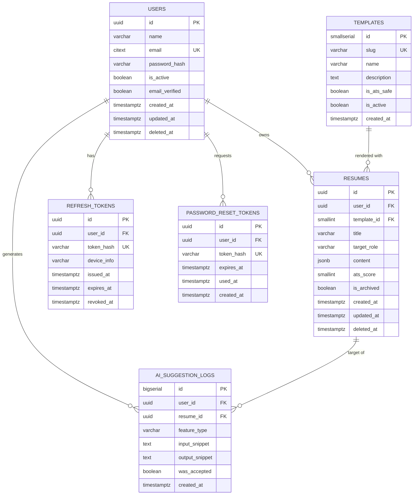

# AI Resume Builder — PostgreSQL Database Schema Design

This document defines the complete database schema derived from the approved engineering blueprint. It covers tables, columns, keys, relationships, constraints, indexes, normalization reasoning, and an ER diagram. No application/business logic code is included — only schema (DDL) definitions, which are the database's own contract, not app code.

---

## 1. Design Philosophy

Two options were considered for storing resume content:

- **Fully relational**: separate tables for `experience_entries`, `education_entries`, `project_entries`, `skills`, etc., each with a foreign key back to `resumes`.
- **Hybrid relational + JSONB** (chosen, per blueprint Section 5): core entities (`users`, `resumes`, `templates`, tokens) are strictly relational and normalized to 3NF; the resume's nested, variable-shape content (experience list, education list, bullet points, skills) is stored as a single `JSONB` column on `resumes`.

**Why the hybrid approach was chosen:**
- Resume sections are naturally nested, order-sensitive, and variable in cardinality (0–N experience entries, each with 0–N bullet points). Modeling this fully relationally would require 5–6 additional tables (experience, education, projects, bullets, skills, certifications) with heavy joins just to reassemble one resume — expensive for a read-heavy feature (every editor load, every PDF export) with no independent query need for individual bullet points outside their parent resume.
- PostgreSQL's `JSONB` is indexable (GIN), validated at the application layer via schema validation (Pydantic/Marshmallow, per blueprint), and still queryable if needed (e.g., `content->'skills'`).
- Core identity, ownership, and access-control data (who owns what, auth tokens, templates) remains strictly relational because these *do* have independent integrity, referential, and query needs (e.g., "all resumes for user X," "revoke this token") that benefit from real foreign keys and constraints.

This is a deliberate, documented denormalization — not an oversight. If future requirements need to query *across* resumes at the bullet-point level (e.g., "find all bullet points mentioning 'Python' across all users' resumes" for an admin analytics feature), that would justify normalizing `experience_entries`/`bullet_points` into their own tables at that time.

---

## 2. Table-by-Table Design

### 2.1 `users`
**Why it exists:** The root identity table. Every other table's ownership traces back here. Authentication, profile, and account lifecycle data live here.

| Column | Type | Constraints | Notes |
|---|---|---|---|
| `id` | `UUID` | `PRIMARY KEY`, `DEFAULT gen_random_uuid()` | UUID chosen over serial int to avoid exposing sequential IDs in URLs/APIs (IDOR risk mitigation, per blueprint Section 8). |
| `name` | `VARCHAR(120)` | `NOT NULL` | |
| `email` | `CITEXT` | `NOT NULL`, `UNIQUE` | `CITEXT` (case-insensitive text) prevents duplicate accounts differing only by case. |
| `password_hash` | `VARCHAR(255)` | `NOT NULL` | Stores bcrypt/argon2 hash only, never plaintext. |
| `is_active` | `BOOLEAN` | `NOT NULL DEFAULT TRUE` | Soft-disable for moderation/suspension without deleting data. |
| `email_verified` | `BOOLEAN` | `NOT NULL DEFAULT FALSE` | Supports future email verification flow. |
| `created_at` | `TIMESTAMPTZ` | `NOT NULL DEFAULT now()` | |
| `updated_at` | `TIMESTAMPTZ` | `NOT NULL DEFAULT now()` | Updated via trigger on row change. |
| `deleted_at` | `TIMESTAMPTZ` | `NULL` | Soft-delete timestamp; supports account deletion (Section 3.9) while allowing a grace-period recovery window before a hard-delete job purges the row. |

---

### 2.2 `templates`
**Why it exists:** Decouples resume *content* from *presentation* (blueprint Section 3.5 — "content and presentation are kept separate in the data model"). A small, admin-managed lookup table rather than a hardcoded frontend enum, so templates can be added/retired without a schema migration.

| Column | Type | Constraints | Notes |
|---|---|---|---|
| `id` | `SMALLSERIAL` | `PRIMARY KEY` | Small, stable lookup table — sequential int is fine here (no ownership/IDOR concern, it's not user-owned data). |
| `slug` | `VARCHAR(50)` | `NOT NULL`, `UNIQUE` | e.g. `'classic-single-column'`, used in frontend/backend rendering logic. |
| `name` | `VARCHAR(100)` | `NOT NULL` | Display name, e.g. "Classic Professional". |
| `description` | `TEXT` | `NULL` | Short marketing/help text shown in template picker. |
| `is_ats_safe` | `BOOLEAN` | `NOT NULL DEFAULT TRUE` | All v1 templates should be `TRUE`; flag reserved for future decorative templates. |
| `is_active` | `BOOLEAN` | `NOT NULL DEFAULT TRUE` | Allows retiring a template without deleting historical references. |
| `created_at` | `TIMESTAMPTZ` | `NOT NULL DEFAULT now()` | |

---

### 2.3 `resumes`
**Why it exists:** The central entity of the product. One row per resume; owns the structured content and links to its owner and chosen template.

| Column | Type | Constraints | Notes |
|---|---|---|---|
| `id` | `UUID` | `PRIMARY KEY`, `DEFAULT gen_random_uuid()` | UUID for the same IDOR-mitigation reason as `users.id`. |
| `user_id` | `UUID` | `NOT NULL`, `REFERENCES users(id) ON DELETE CASCADE` | Ownership. Cascade delete: if a user is hard-deleted, their resumes go with them (GDPR-style right-to-erasure). |
| `template_id` | `SMALLINT` | `NOT NULL`, `REFERENCES templates(id) ON DELETE RESTRICT` | `RESTRICT` (not cascade) — prevents accidentally deleting a template still in use by existing resumes; template must be deactivated (`is_active = FALSE`) instead. |
| `title` | `VARCHAR(150)` | `NOT NULL DEFAULT 'Untitled Resume'` | User-facing name shown on dashboard cards. |
| `target_role` | `VARCHAR(120)` | `NULL` | Optional tag, e.g. "Backend Internship" (Section 3.3). |
| `content` | `JSONB` | `NOT NULL DEFAULT '{}'` | Structured resume data: personal info, summary, experience[], education[], projects[], skills{}, certifications[], achievements[]. Validated at the application layer against a fixed schema before every write. |
| `ats_score` | `SMALLINT` | `NULL`, `CHECK (ats_score BETWEEN 0 AND 100)` | Cached result of the last ATS checklist run (Section 3.8), avoids recomputing on every dashboard render. |
| `is_archived` | `BOOLEAN` | `NOT NULL DEFAULT FALSE` | Soft "hide from dashboard" without deleting. |
| `created_at` | `TIMESTAMPTZ` | `NOT NULL DEFAULT now()` | |
| `updated_at` | `TIMESTAMPTZ` | `NOT NULL DEFAULT now()` | Updated on every autosave; drives "last edited" display on dashboard. |
| `deleted_at` | `TIMESTAMPTZ` | `NULL` | Soft-delete, mirrors `users.deleted_at` — lets "Delete" in the UI be undoable briefly before a hard purge. |

**Content JSONB shape (informational, not enforced by Postgres — enforced by app-layer schema validation):**
```
{
  "personal_info": { "full_name", "email", "phone", "location", "links": [...] },
  "summary": "string",
  "experience": [ { "role", "company", "start_date", "end_date", "bullets": ["..."] } ],
  "education": [ { "institution", "degree", "start_date", "end_date", "details" } ],
  "projects": [ { "name", "description", "bullets": ["..."], "tech_stack": [...] } ],
  "skills": { "technical": [...], "tools": [...], "soft": [...] },
  "certifications": [ { "name", "issuer", "date" } ],
  "achievements": ["..."]
}
```

---

### 2.4 `refresh_tokens`
**Why it exists:** JWT access tokens are stateless and short-lived (blueprint Section 5), but refresh tokens must be revocable (logout, password change, account compromise) — which requires server-side state. This table is that state.

| Column | Type | Constraints | Notes |
|---|---|---|---|
| `id` | `UUID` | `PRIMARY KEY`, `DEFAULT gen_random_uuid()` | |
| `user_id` | `UUID` | `NOT NULL`, `REFERENCES users(id) ON DELETE CASCADE` | |
| `token_hash` | `VARCHAR(255)` | `NOT NULL`, `UNIQUE` | Store a *hash* of the refresh token, never the raw token (defense-in-depth if the table is ever exposed). |
| `device_info` | `VARCHAR(255)` | `NULL` | Optional user-agent/device label, supports future "active sessions" UI. |
| `issued_at` | `TIMESTAMPTZ` | `NOT NULL DEFAULT now()` | |
| `expires_at` | `TIMESTAMPTZ` | `NOT NULL` | Enforced at the application layer on each refresh attempt. |
| `revoked_at` | `TIMESTAMPTZ` | `NULL` | Set on logout or rotation; a non-null value means the token is no longer valid even if not yet expired. |

---

### 2.5 `password_reset_tokens`
**Why it exists:** Separate from `refresh_tokens` because password-reset tokens have different semantics (single-use, very short expiry, triggered by an unauthenticated "forgot password" flow) and mixing them with session tokens would conflate two different security-sensitive concerns.

| Column | Type | Constraints | Notes |
|---|---|---|---|
| `id` | `UUID` | `PRIMARY KEY`, `DEFAULT gen_random_uuid()` | |
| `user_id` | `UUID` | `NOT NULL`, `REFERENCES users(id) ON DELETE CASCADE` | |
| `token_hash` | `VARCHAR(255)` | `NOT NULL`, `UNIQUE` | Hashed, same reasoning as `refresh_tokens.token_hash`. |
| `expires_at` | `TIMESTAMPTZ` | `NOT NULL` | Short-lived, e.g. 15–30 minutes. |
| `used_at` | `TIMESTAMPTZ` | `NULL` | Marks single-use; a non-null value invalidates the token even if not expired. |
| `created_at` | `TIMESTAMPTZ` | `NOT NULL DEFAULT now()` | |

---

### 2.6 `ai_suggestion_logs`
**Why it exists:** Three purposes: (1) enables per-user AI rate limiting (blueprint Risks, Section 8 — "insufficient rate limiting on AI endpoints"), (2) provides an audit trail of what the AI generated vs. what the user ultimately kept, useful for debugging prompt quality, (3) supports future analytics ("which AI feature is used most"). This is an append-only, high-volume table — deliberately kept separate from `resumes` so it doesn't bloat or lock the hot path table.

| Column | Type | Constraints | Notes |
|---|---|---|---|
| `id` | `BIGSERIAL` | `PRIMARY KEY` | High-volume, append-only, sequential bigint is appropriate and cheaper than UUID here — no user-facing exposure of this ID. |
| `user_id` | `UUID` | `NOT NULL`, `REFERENCES users(id) ON DELETE CASCADE` | Used for per-user rate-limit queries. |
| `resume_id` | `UUID` | `NULL`, `REFERENCES resumes(id) ON DELETE SET NULL` | Nullable + `SET NULL` (not cascade): if the resume is later deleted, we keep the log row for auditing/rate-limit history but detach it from the (now-gone) resume. |
| `feature_type` | `VARCHAR(30)` | `NOT NULL`, `CHECK (feature_type IN ('bullet_improve','summary_generate','keyword_match'))` | Constrains to the known AI features from Section 3.7. |
| `input_snippet` | `TEXT` | `NOT NULL` | The text sent to Gemini (truncated at app layer to a reasonable length before storage). |
| `output_snippet` | `TEXT` | `NULL` | The AI's response; nullable to allow logging failed/errored calls too. |
| `was_accepted` | `BOOLEAN` | `NULL` | Whether the user accepted the suggestion, if known — feeds future prompt-quality analysis. |
| `created_at` | `TIMESTAMPTZ` | `NOT NULL DEFAULT now()` | Indexed alongside `user_id` for sliding-window rate-limit checks. |

---

## 3. Relationships Summary

| Relationship | Type | Cascade Behavior |
|---|---|---|
| `users` → `resumes` | One-to-Many | `ON DELETE CASCADE` (delete user ⇒ delete their resumes) |
| `users` → `refresh_tokens` | One-to-Many | `ON DELETE CASCADE` |
| `users` → `password_reset_tokens` | One-to-Many | `ON DELETE CASCADE` |
| `users` → `ai_suggestion_logs` | One-to-Many | `ON DELETE CASCADE` |
| `templates` → `resumes` | One-to-Many | `ON DELETE RESTRICT` (template can't be deleted while resumes reference it) |
| `resumes` → `ai_suggestion_logs` | One-to-Many | `ON DELETE SET NULL` (log outlives the resume) |

No many-to-many relationships exist in this schema — every relationship is a simple ownership hierarchy, which keeps join complexity low for the hottest queries (dashboard list, editor load).

---

## 4. Normalization Decisions

- **Users, templates, tokens, and AI logs are in 3NF**: every non-key column depends only on the primary key, no transitive dependencies, no repeating groups. There's nothing to further decompose — each table represents exactly one entity.
- **`resumes.content` is an intentional denormalization** (documented in Section 1) for the reasons given: nested, variable-cardinality, always-read-and-written-as-a-whole data with no current cross-resume query requirement.
- **Soft deletes (`deleted_at`) instead of hard deletes** on `users` and `resumes` are a deliberate trade-off: they add a `WHERE deleted_at IS NULL` condition to most queries (mitigated by partial indexes, see Section 5) but provide a safety net against accidental data loss and support a "recently deleted, restore within 30 days" UX pattern common in production SaaS tools.
- **UUID primary keys for user-facing entities** (`users`, `resumes`, `refresh_tokens`, `password_reset_tokens`) vs. **serial/bigserial for internal-only entities** (`templates`, `ai_suggestion_logs`) is a consistent, justified split: UUIDs where IDs are exposed in URLs/APIs and predictability is a security concern; sequential IDs where the table is either a small internal lookup or a high-volume log table where UUID's storage/index overhead isn't worth paying for.

---

## 5. Indexes

```sql
-- users
CREATE UNIQUE INDEX idx_users_email ON users (email);
CREATE INDEX idx_users_active ON users (id) WHERE deleted_at IS NULL;

-- resumes
CREATE INDEX idx_resumes_user_id ON resumes (user_id) WHERE deleted_at IS NULL;
CREATE INDEX idx_resumes_updated_at ON resumes (user_id, updated_at DESC);
CREATE INDEX idx_resumes_content_gin ON resumes USING GIN (content);

-- refresh_tokens
CREATE INDEX idx_refresh_tokens_user_id ON refresh_tokens (user_id);
CREATE UNIQUE INDEX idx_refresh_tokens_hash ON refresh_tokens (token_hash);
CREATE INDEX idx_refresh_tokens_expiry ON refresh_tokens (expires_at) WHERE revoked_at IS NULL;

-- password_reset_tokens
CREATE UNIQUE INDEX idx_pw_reset_hash ON password_reset_tokens (token_hash);

-- ai_suggestion_logs
CREATE INDEX idx_ai_logs_user_created ON ai_suggestion_logs (user_id, created_at DESC);
CREATE INDEX idx_ai_logs_resume_id ON ai_suggestion_logs (resume_id);
```

**Rationale:**
- `idx_resumes_user_id` (partial, excluding soft-deleted rows) is the single most-hit index in the app — every dashboard load filters by `user_id`.
- `idx_resumes_updated_at` is a composite index supporting the dashboard's default "most recently edited first" sort without a separate sort step.
- `idx_resumes_content_gin` (GIN index on JSONB) enables efficient containment/key-existence queries on resume content if ever needed (e.g., "resumes missing a skills section" for an internal QA query), without which every such query would require a full table scan and JSON parse per row.
- `idx_ai_logs_user_created` is what makes rate-limiting (`COUNT(*) WHERE user_id = ? AND created_at > now() - interval '1 hour'`) an index-only scan instead of a sequential scan as log volume grows.
- Partial indexes (`WHERE deleted_at IS NULL`, `WHERE revoked_at IS NULL`) keep the index smaller and faster by excluding rows the app almost never queries for (soft-deleted/revoked records), rather than indexing the whole table and filtering at query time.

---

## 6. Constraints Summary

- **Primary keys** on every table (Section 2).
- **Foreign keys** with explicit `ON DELETE` behavior chosen per relationship, not left to default (Section 3).
- **`UNIQUE`** on `users.email`, `templates.slug`, `refresh_tokens.token_hash`, `password_reset_tokens.token_hash` — prevents duplicate accounts and token collisions at the database level, not just the application level (defense in depth).
- **`CHECK`** constraints: `resumes.ats_score BETWEEN 0 AND 100`, `ai_suggestion_logs.feature_type IN (...)` — catch invalid data even if application-layer validation is ever bypassed or buggy.
- **`NOT NULL`** on every column that the application logic assumes will always be present, rather than relying on application code alone to guarantee it.
- **`updated_at` auto-maintenance**: a lightweight `BEFORE UPDATE` trigger (one per table with an `updated_at` column) sets `updated_at = now()` on every row modification, so this timestamp can never drift out of sync due to an application bug that forgets to set it manually.

---

## 7. Entity-Relationship Diagram



---

## 8. Full DDL Reference

```sql
CREATE EXTENSION IF NOT EXISTS "pgcrypto";
CREATE EXTENSION IF NOT EXISTS "citext";

CREATE TABLE users (
    id              UUID PRIMARY KEY DEFAULT gen_random_uuid(),
    name            VARCHAR(120) NOT NULL,
    email           CITEXT NOT NULL UNIQUE,
    password_hash   VARCHAR(255) NOT NULL,
    is_active       BOOLEAN NOT NULL DEFAULT TRUE,
    email_verified  BOOLEAN NOT NULL DEFAULT FALSE,
    created_at      TIMESTAMPTZ NOT NULL DEFAULT now(),
    updated_at      TIMESTAMPTZ NOT NULL DEFAULT now(),
    deleted_at      TIMESTAMPTZ
);

CREATE TABLE templates (
    id              SMALLSERIAL PRIMARY KEY,
    slug            VARCHAR(50) NOT NULL UNIQUE,
    name            VARCHAR(100) NOT NULL,
    description     TEXT,
    is_ats_safe     BOOLEAN NOT NULL DEFAULT TRUE,
    is_active       BOOLEAN NOT NULL DEFAULT TRUE,
    created_at      TIMESTAMPTZ NOT NULL DEFAULT now()
);

CREATE TABLE resumes (
    id              UUID PRIMARY KEY DEFAULT gen_random_uuid(),
    user_id         UUID NOT NULL REFERENCES users(id) ON DELETE CASCADE,
    template_id     SMALLINT NOT NULL REFERENCES templates(id) ON DELETE RESTRICT,
    title           VARCHAR(150) NOT NULL DEFAULT 'Untitled Resume',
    target_role     VARCHAR(120),
    content         JSONB NOT NULL DEFAULT '{}',
    ats_score       SMALLINT CHECK (ats_score BETWEEN 0 AND 100),
    is_archived     BOOLEAN NOT NULL DEFAULT FALSE,
    created_at      TIMESTAMPTZ NOT NULL DEFAULT now(),
    updated_at      TIMESTAMPTZ NOT NULL DEFAULT now(),
    deleted_at      TIMESTAMPTZ
);

CREATE TABLE refresh_tokens (
    id              UUID PRIMARY KEY DEFAULT gen_random_uuid(),
    user_id         UUID NOT NULL REFERENCES users(id) ON DELETE CASCADE,
    token_hash      VARCHAR(255) NOT NULL UNIQUE,
    device_info     VARCHAR(255),
    issued_at       TIMESTAMPTZ NOT NULL DEFAULT now(),
    expires_at      TIMESTAMPTZ NOT NULL,
    revoked_at      TIMESTAMPTZ
);

CREATE TABLE password_reset_tokens (
    id              UUID PRIMARY KEY DEFAULT gen_random_uuid(),
    user_id         UUID NOT NULL REFERENCES users(id) ON DELETE CASCADE,
    token_hash      VARCHAR(255) NOT NULL UNIQUE,
    expires_at      TIMESTAMPTZ NOT NULL,
    used_at         TIMESTAMPTZ,
    created_at      TIMESTAMPTZ NOT NULL DEFAULT now()
);

CREATE TABLE ai_suggestion_logs (
    id              BIGSERIAL PRIMARY KEY,
    user_id         UUID NOT NULL REFERENCES users(id) ON DELETE CASCADE,
    resume_id       UUID REFERENCES resumes(id) ON DELETE SET NULL,
    feature_type    VARCHAR(30) NOT NULL CHECK (feature_type IN ('bullet_improve','summary_generate','keyword_match')),
    input_snippet   TEXT NOT NULL,
    output_snippet  TEXT,
    was_accepted    BOOLEAN,
    created_at      TIMESTAMPTZ NOT NULL DEFAULT now()
);

-- Indexes (see Section 5 for full list and rationale)
CREATE INDEX idx_resumes_user_id ON resumes (user_id) WHERE deleted_at IS NULL;
CREATE INDEX idx_resumes_updated_at ON resumes (user_id, updated_at DESC);
CREATE INDEX idx_resumes_content_gin ON resumes USING GIN (content);
CREATE INDEX idx_refresh_tokens_user_id ON refresh_tokens (user_id);
CREATE INDEX idx_refresh_tokens_expiry ON refresh_tokens (expires_at) WHERE revoked_at IS NULL;
CREATE INDEX idx_ai_logs_user_created ON ai_suggestion_logs (user_id, created_at DESC);
CREATE INDEX idx_ai_logs_resume_id ON ai_suggestion_logs (resume_id);
```

*Note: this is schema (DDL), not application code — it defines the database's own structure and constraints, consistent with the "no application code yet" instruction from the original blueprint request.*

---

## 9. Future Schema Extensions (Not in MVP)

Referenced against blueprint Section 2 ("Nice to Have" / "Future Features") — not created now, but the current schema doesn't preclude them:

- **`resume_versions`**: would store historical snapshots of `resumes.content` for version history/rollback (v2 feature). Straightforward one-to-many addition against `resumes`.
- **`shared_resume_links`**: for public shareable view-only links — would need `resume_id FK`, a unique `share_token`, `expires_at`, and `view_count`.
- **`teams` / `team_members`**: if mentor/recruiter multi-user accounts are added (Future Features), would introduce the schema's first true many-to-many relationship.

These are intentionally excluded now to keep the MVP schema minimal and aligned with actual current requirements, per the blueprint's YAGNI-conscious MVP scoping.
