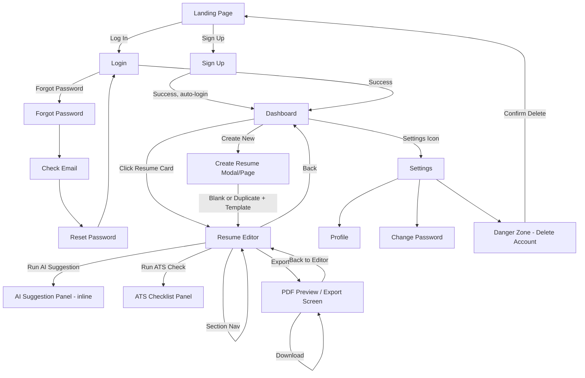

# AI Resume Builder — UI/UX Design Specification

This document defines the complete UI/UX design built on top of the approved Engineering Blueprint, Database Schema, and REST API Specification. It covers page hierarchy, navigation, wireframes, component architecture, form design, and all interaction states. No React code is included — this is a design/architecture document only.

---

## 1. Complete Page Hierarchy

```
/                          Landing Page (public)
/signup                    Sign Up (public)
/login                     Login (public)
/forgot-password           Forgot Password (public)
/reset-password            Reset Password (public, token-gated)

/dashboard                 Dashboard (protected) — resume list
/resumes/new                Create Resume (protected) — template + blank/duplicate choice
/resumes/:resumeId/edit     Resume Editor (protected)
   ├── ?section=personal-info
   ├── ?section=summary
   ├── ?section=experience
   ├── ?section=education
   ├── ?section=projects
   ├── ?section=skills
   ├── ?section=certifications
   └── ?section=achievements
/resumes/:resumeId/preview  PDF Preview / Export (protected)
/resumes/:resumeId/ats-check ATS Checklist (protected) — can also render as a panel within editor

/settings                  Account Settings (protected)
   ├── /settings/profile
   ├── /settings/password
   └── /settings/danger-zone  (delete account)

/404                        Not Found (public)
/error                       Generic error boundary page (public)
```

**Route protection:** `/dashboard`, `/resumes/*`, `/settings/*` require a valid access token (protected route wrapper redirects to `/login` with a `?redirectTo=` param on auth failure, so the user returns to where they were headed after logging in).

**Editor sub-routing philosophy:** The editor uses a single route (`/resumes/:resumeId/edit`) with a `?section=` query param rather than nested routes per section — this keeps the resume data fetched once (via `GET /resumes/{resumeId}`) and shared across all sections in memory, avoiding a re-fetch on every section switch, while still making each section deep-linkable and back-button-navigable.

---

## 2. Navigation Flow (Mermaid)



---

## 3. User Journeys

### Journey 1 — First-Time User (Aditi, Section 1.4 of Blueprint)
Landing Page → Sign Up → auto-redirected to Dashboard (empty state) → clicks "Create Your First Resume" → picks a blank template → lands in Editor with Personal Info section active → fills sections sequentially via left-nav → clicks "Improve with AI" on a weak bullet → accepts suggestion → runs ATS Check → sees 2 warnings, fixes them inline → exports PDF → returns to Dashboard, now showing 1 resume card.

### Journey 2 — Returning User Tailoring a Resume (Section 3.3)
Login → Dashboard (shows 3 existing resumes) → clicks "Duplicate" on "Backend Internship Resume" card → renames copy to "ML Internship Resume" → Editor opens with duplicated content → edits Summary and Skills sections only → re-runs AI Keyword Match against a pasted JD → adds 2 suggested skills → exports → Dashboard now shows 4 cards.

### Journey 3 — Error Recovery (AI Service Down)
User in Editor clicks "Improve with AI" → request fails (`503`) → inline error state appears in the AI panel: "AI suggestions are temporarily unavailable. You can keep editing manually." → user dismisses and continues editing normally; autosave and export remain unaffected.

---

## 4. Wireframes

### 4.1 Landing Page
```
┌──────────────────────────────────────────────────────────┐
│ LOGO            Features   Pricing        [Log In] [Sign Up]│
├──────────────────────────────────────────────────────────┤
│                                                              │
│        Build an ATS-Ready Resume in Minutes — with AI       │
│        [ Get Started Free ]   [ See How It Works ]          │
│                                                              │
│        [ Hero mockup: editor + AI suggestion side panel ]   │
│                                                              │
├──────────────────────────────────────────────────────────┤
│  Feature 1: AI Bullet    Feature 2: ATS      Feature 3:      │
│  Improvement             Checker             Multi-Resume    │
│  [icon] short copy       [icon] short copy   [icon] short    │
├──────────────────────────────────────────────────────────┤
│  Footer: Links | GitHub | Contact                            │
└──────────────────────────────────────────────────────────┘
```

### 4.2 Sign Up / Login
```
┌───────────────────────────────┐
│            LOGO                │
│      Create your account       │
│  ┌───────────────────────────┐ │
│  │ Name                      │ │
│  └───────────────────────────┘ │
│  ┌───────────────────────────┐ │
│  │ Email                     │ │
│  └───────────────────────────┘ │
│  ┌───────────────────────────┐ │
│  │ Password        [👁 show] │ │
│  └───────────────────────────┘ │
│  [ password strength bar ]     │
│  [        Sign Up Button      ]│
│  Already have an account? Login│
└───────────────────────────────┘
```

### 4.3 Dashboard
```
┌──────────────────────────────────────────────────────────────┐
│ LOGO      Dashboard                    🌙  👤 Aditi ▾          │
├──────────────────────────────────────────────────────────────┤
│  My Resumes                         [Search...] [Sort ▾] [+New]│
├──────────────────────────────────────────────────────────────┤
│ ┌───────────────┐ ┌───────────────┐ ┌───────────────┐          │
│ │ [thumbnail]   │ │ [thumbnail]   │ │ [thumbnail]   │          │
│ │ Backend Intern│ │ ML Internship │ │ PM Role Resume│          │
│ │ Edited 2d ago │ │ Edited 5h ago │ │ Edited 1w ago │          │
│ │ ATS: 82%      │ │ ATS: 91%      │ │ ATS: 65%      │          │
│ │ [Edit][⋮ Menu]│ │ [Edit][⋮ Menu]│ │ [Edit][⋮ Menu]│          │
│ └───────────────┘ └───────────────┘ └───────────────┘          │
│                                                                  │
│                    [ + Create New Resume ]                     │
│                                                                  │
│                    ◀ Page 1 of 1 ▶                              │
└──────────────────────────────────────────────────────────────┘
```
`⋮ Menu` opens: Rename · Duplicate · Archive · Delete (destructive, red, confirmation modal).

**Empty state (0 resumes):**
```
┌──────────────────────────────────────────────────┐
│              [ illustration ]                      │
│        You haven't created a resume yet.           │
│    Let's build one — it only takes a few minutes.  │
│           [ + Create Your First Resume ]            │
└──────────────────────────────────────────────────┘
```

### 4.4 Create Resume (Modal or Dedicated Page)
```
┌───────────────────────────────────────────┐
│  Create New Resume                    [x]  │
├───────────────────────────────────────────┤
│  Start from:                                │
│   ( ) Blank Resume                          │
│   ( ) Duplicate existing → [dropdown]       │
│                                              │
│  Choose a template:                         │
│   [thumb 1 ✓] [thumb 2] [thumb 3]           │
│                                              │
│  Resume Title: [______________________]     │
│  Target Role (optional): [_______________]  │
│                                              │
│               [Cancel]   [Create Resume]    │
└───────────────────────────────────────────┘
```

### 4.5 Resume Editor (Desktop — 3-pane layout)
```
┌──────────────────────────────────────────────────────────────────────┐
│ ← Dashboard   "Backend Internship Resume"  [Saved ✓ 2s ago]  [Export]│
├───────────────┬────────────────────────────────┬─────────────────────┤
│ SECTION NAV   │  EDITOR FORM (active section)   │  LIVE PREVIEW /      │
│               │                                  │  AI PANEL (tabs)     │
│ ● Personal    │  Professional Summary            │ ┌─────────────────┐ │
│   Info        │  ┌────────────────────────────┐ │ │ [Preview] [AI]  │ │
│ ● Summary     │  │ Motivated CS student...     │ │ ├─────────────────┤ │
│ ● Experience  │  │                              │ │ │ (thumbnail-size │ │
│ ● Education   │  └────────────────────────────┘ │ │  live resume     │ │
│ ● Projects    │  [ ✨ Generate with AI ]         │ │  render, updates │ │
│ ● Skills      │                                  │ │  as user types)  │ │
│ ● Certs       │  ─────────────────────────────  │ │                  │ │
│ ● Achievements│  Experience                      │ └─────────────────┘ │
│               │  ┌────────────────────────────┐ │                       │
│ [Run ATS      │  │ Role: [___] Company: [___]  │ │                       │
│  Check]       │  │ Dates: [___] – [___]         │ │                       │
│               │  │ Bullets:                     │ │                       │
│               │  │  • worked on backend feat... │ │                       │
│               │  │    [✨ Improve] [🗑]          │ │                       │
│               │  │  • [+ Add bullet]             │ │                       │
│               │  └────────────────────────────┘ │                       │
│               │  [+ Add Experience Entry]        │                       │
└───────────────┴────────────────────────────────┴─────────────────────┘
```

### 4.6 AI Suggestion Panel (Inline, expands under the bullet clicked)
```
┌──────────────────────────────────────────────────────────┐
│  • worked on backend features                              │
│    [✨ Improve] [🗑]                                        │
│  ┌────────────────────────────────────────────────────┐   │
│  │ ✨ AI Suggestion                        AI-generated │   │
│  │ "Developed and shipped 4 backend REST API features, │   │
│  │  reducing average response latency by 15%."         │   │
│  │                                                       │   │
│  │  [ Accept ]   [ Edit before accepting ]  [ Discard ] │   │
│  └────────────────────────────────────────────────────┘   │
└──────────────────────────────────────────────────────────┘
```
**Loading state (while Gemini call is in-flight):**
```
│  ┌────────────────────────────────────────────────────┐
│  │ ✨ Generating suggestion...  [ ⣾ spinner ]           │
│  └────────────────────────────────────────────────────┘
```
**Error state:**
```
│  ┌────────────────────────────────────────────────────┐
│  │ ⚠ AI suggestions are temporarily unavailable.        │
│  │   You can keep editing manually.       [ Retry ]     │
│  └────────────────────────────────────────────────────┘
```

### 4.7 ATS Checker Panel
```
┌───────────────────────────────────────────┐
│  ATS Compatibility Check         Score: 78%│
├───────────────────────────────────────────┤
│  ✅ Contact info present                    │
│  ✅ Skills section present                  │
│  ⚠️  Inconsistent date formats               │
│      → 2 entries use different formats      │
│  ✅ Bullet length within range               │
├───────────────────────────────────────────┤
│  Paste a job description to check keyword   │
│  match:                                      │
│  ┌─────────────────────────────────────┐    │
│  │                                       │    │
│  └─────────────────────────────────────┘    │
│  [ Check Keywords ]                          │
│                                               │
│  Missing keywords found: Docker, CI/CD       │
└───────────────────────────────────────────┘
```

### 4.8 PDF Preview / Export Screen
```
┌──────────────────────────────────────────────────────────┐
│ ← Back to Editor        Export Resume                      │
├───────────────────┬────────────────────────────────────────┤
│  Template:         │                                         │
│  [thumb ✓][thumb]  │      ┌───────────────────────┐          │
│                    │      │                         │          │
│  [ Generate PDF ]  │      │   Full-page PDF         │          │
│                    │      │   preview render        │          │
│  Status:           │      │                         │          │
│  ● Ready            │      │                         │          │
│                    │      └───────────────────────┘          │
│  [ ⬇ Download PDF ]│                                         │
└───────────────────┴────────────────────────────────────────┘
```
**Generating state:** button disabled, shows `[ ⣾ Generating... ]`, preview pane shows a skeleton loader instead of blank space.

### 4.9 Settings
```
┌──────────────────────────────────────────────────┐
│ Settings                                            │
├───────────┬────────────────────────────────────────┤
│ Profile   │  Name: [______________]                 │
│ Password  │  Email: [______________]                │
│ Danger    │  [ Save Changes ]                        │
│ Zone      │                                           │
└───────────┴────────────────────────────────────────┘
```
**Danger Zone tab:**
```
┌──────────────────────────────────────────┐
│  ⚠ Delete Account                          │
│  This will permanently remove all your      │
│  resumes and account data.                  │
│  Enter password to confirm: [__________]    │
│  [ Delete My Account ]  (red, destructive)  │
└──────────────────────────────────────────┘
```

---

## 5. Reusable React Component Inventory (Design Only — No Code)

### Common / Design System Layer
- `Button` (variants: primary, secondary, destructive, ghost, icon-only; states: default, hover, loading, disabled)
- `Input` / `TextArea` (states: default, focus, error, disabled; supports label + helper text + error text)
- `Select` / `Dropdown`
- `Modal` (used for Create Resume, Delete Confirmation)
- `Toast` / `Notification` (autosave confirmations, error banners)
- `Spinner` / `SkeletonLoader`
- `Badge` (used for ATS score chip, "AI-generated" label)
- `Card` (base for Resume Card, Feature Card)
- `Tabs` (used in editor's Preview/AI panel switch, Settings nav)
- `Avatar` / `UserMenu`
- `ProgressBar` (password strength, ATS score, resume completeness)
- `EmptyState` (generic, parameterized by icon/title/CTA — reused across Dashboard-empty, no-search-results, etc.)
- `ErrorBoundaryFallback`

### Feature-Level Components
- `ResumeCard` (dashboard grid item: thumbnail, title, metadata, menu)
- `ResumeCardMenu` (rename/duplicate/archive/delete dropdown)
- `CreateResumeModal`
- `TemplatePicker` (thumbnail grid, used in Create modal + Export screen)
- `SectionNav` (left rail in editor)
- `SectionForm` — a family of components per section:
  - `PersonalInfoForm`
  - `SummaryForm`
  - `ExperienceForm` (contains repeatable `ExperienceEntry`)
  - `EducationForm` (contains repeatable `EducationEntry`)
  - `ProjectsForm` (contains repeatable `ProjectEntry`)
  - `SkillsForm` (categorized tag input)
  - `CertificationsForm`
  - `AchievementsForm`
- `BulletListEditor` (shared by Experience/Projects — add/remove/reorder bullets, each with an "Improve with AI" trigger)
- `AISuggestionCard` (loading/success/error states, accept/edit/discard actions)
- `LivePreviewPane` (renders current `content` + selected template at thumbnail scale)
- `AutosaveIndicator` ("Saving...", "Saved ✓", "Save failed — retry")
- `ATSChecklistPanel`
- `ATSRuleRow` (pass/fail row with optional detail message)
- `KeywordMatchInput` (JD paste box + results)
- `PDFPreviewPane`
- `ExportButton` (handles the generate → poll/ready → download states)
- `SettingsTabs` / `ProfileForm` / `ChangePasswordForm` / `DangerZonePanel`
- `ProtectedRoute` (auth wrapper, redirect-with-return logic)

---

## 6. Component Hierarchy (Editor Page — Deepest/Most Complex Page)

```
ResumeEditorPage
├── EditorHeader
│   ├── BackToDashboardLink
│   ├── ResumeTitleInlineEdit
│   ├── AutosaveIndicator
│   └── ExportButton
├── SectionNav
│   └── SectionNavItem (×8)
├── EditorMainPanel
│   └── [Active] SectionForm
│       ├── PersonalInfoForm
│       ├── SummaryForm
│       │   └── GenerateWithAIButton → AISuggestionCard
│       ├── ExperienceForm
│       │   └── ExperienceEntry (×N)
│       │       └── BulletListEditor
│       │           └── BulletItem (×N)
│       │               └── ImproveWithAIButton → AISuggestionCard
│       ├── EducationForm → EducationEntry (×N)
│       ├── ProjectsForm → ProjectEntry (×N) → BulletListEditor
│       ├── SkillsForm → TagInput (×3 categories)
│       ├── CertificationsForm → CertificationEntry (×N)
│       └── AchievementsForm → AchievementItem (×N)
└── EditorSidePanel (Tabs)
    ├── LivePreviewPane
    └── ATSChecklistPanel
        └── ATSRuleRow (×N)
        └── KeywordMatchInput
```

---

## 7. Form Design Principles

- **Section-scoped forms, not one giant form:** each section (Experience, Education, etc.) is its own form context, matching the JSONB content structure from the schema — this keeps validation errors localized and autosave payloads small (aligns with the API's deep-merge `PATCH` design).
- **Inline validation, not submit-time only:** required fields (e.g., email format, date ranges where end date must be after start date) validate on blur, with error text appearing directly under the field — never a top-of-page error summary alone.
- **Repeatable entries (Experience, Education, Projects, Certifications)** use an "Add Entry" pattern with drag-handle reordering and a confirmation step on delete (a destructive action inside a form that a user could trigger accidentally).
- **Bullet points are list items, not paragraph text** in the UI, enforcing the ATS-safe data model from the blueprint at the input level, not just at export time.
- **Character/length hints** shown as a small counter (e.g., "142/300") on bullet and summary fields, turning amber near the limit and red if exceeded, rather than silently truncating.

---

## 8. Responsive Design Strategy

| Breakpoint | Range | Layout Adaptation |
|---|---|---|
| Mobile | < 640px | Editor collapses to a single-pane, tab-switched layout: Section Nav becomes a horizontal scrollable chip bar or a bottom sheet; Live Preview/AI panel becomes a separate tab, not a side panel. Dashboard grid becomes a single column list. |
| Tablet | 640–1024px | Editor becomes 2-pane (Section Nav collapses into a hamburger/drawer; Form + Preview/AI tabs remain). Dashboard grid becomes 2 columns. |
| Desktop | > 1024px | Full 3-pane editor layout as wireframed in Section 4.5. Dashboard grid becomes 3–4 columns. |

**Editor-specific mobile consideration:** because the 3-pane layout is the most information-dense screen in the app, mobile deliberately trades simultaneous visibility for focus — the user edits one section at a time and explicitly taps "Preview" to check the result, rather than trying to cram a live side-by-side preview onto a small screen (which would make both panes too small to be useful).

**Touch targets:** all interactive elements (buttons, menu triggers, bullet add/remove icons) maintain a minimum 44×44px touch target on mobile/tablet breakpoints, per standard accessibility guidance — larger than their desktop hover-state equivalents.

---

## 9. Loading States

| Context | Treatment |
|---|---|
| Dashboard initial load | Skeleton resume cards (3–4 gray pulsing placeholders) instead of a spinner, to preserve layout stability. |
| Editor initial load | Skeleton form fields matching the shape of the active section. |
| Autosave in-flight | Small inline `AutosaveIndicator` text change: "Saving..." → "Saved ✓" (no blocking spinner — editing must remain uninterrupted per NFR). |
| AI suggestion generating | Inline spinner + "Generating suggestion..." text within the `AISuggestionCard`, button disabled to prevent duplicate requests. |
| ATS check running | Checklist rows show a shimmer/skeleton state per row until the result returns. |
| PDF export generating | Export button shows a spinner and disables; preview pane shows a skeleton page outline. |
| Render-blocking data (e.g., resume fetch before editor can render at all) | Full-page centered spinner only as a last resort, used sparingly since skeletons are preferred everywhere else. |

---

## 10. Error States

| Context | Treatment |
|---|---|
| Form field validation error | Red border + inline error text under the field, per Section 7. |
| Network/API failure on save | Toast notification: "Couldn't save your changes. Retrying..." with automatic retry; if retry also fails, `AutosaveIndicator` shows "Save failed — [Retry]" persistently until resolved, so the user is never silently out of sync. |
| AI endpoint `429` (rate limited) | `AISuggestionCard` shows: "You've hit the AI suggestion limit for now. Try again in a few minutes." — not a generic error, since this is an expected, explainable state. |
| AI endpoint `503` (Gemini down) | As wireframed in Section 4.6 — reassures the user that core editing/export is unaffected. |
| Resume not found / not owned (`404`) | Full-page friendly error: "We couldn't find that resume. It may have been deleted." with a button back to Dashboard. |
| Generic unhandled error (`500`) | App-level error boundary renders a friendly fallback page (not a blank white screen or raw stack trace), with a "Reload" button and a link back to Dashboard. |
| PDF export failure | Inline error in the Export screen: "Something went wrong generating your PDF. [Try Again]" — preview pane keeps the last successful render visible if one exists, rather than clearing it. |

---

## 11. Empty States

| Context | Treatment |
|---|---|
| Dashboard, 0 resumes | Illustration + "You haven't created a resume yet" + primary CTA (Section 4.3). |
| Dashboard, search/filter returns 0 results | Distinct from the true-zero-resumes state: "No resumes match your search." + "Clear filters" action, so the user isn't told to "create their first resume" when they actually have resumes that just don't match the current filter. |
| Experience/Education/Projects section, 0 entries | Inline prompt inside the form area: "No experience added yet." + "+ Add Experience" button, styled less prominently than the Dashboard empty state since it's a sub-section, not the whole page. |
| ATS Checklist, not yet run | "Run a check to see how ATS-friendly your resume is." + `[ Run ATS Check ]` button, rather than showing an empty checklist shell. |
| Skills section, 0 skills in a category | Placeholder text inside the tag input: "Add technical skills (e.g. Python, React)..." |

---

## 12. Dark Mode Considerations

- Dark mode is a user preference (toggle in header, per blueprint Section 3.9 Settings), persisted per-user (stored client-side; could later sync to a `preferences` field if added to the schema — not required for MVP).
- **Resume Live Preview and PDF Preview panes always render in light mode**, regardless of the app's theme — because the exported PDF itself is always white-background/black-text (standard ATS-safe convention), previewing it in a dark-inverted style would misrepresent the actual export and confuse users about what they're producing.
- Semantic color tokens (not hardcoded hex values) are used throughout — e.g., `--color-surface`, `--color-text-primary`, `--color-border`, `--color-danger` — so dark mode is a token-swap, not a component-by-component override.
- Status colors (ATS checklist ✅/⚠️, AI "generated" badge, autosave indicator) maintain sufficient contrast in both themes — validated against WCAG AA contrast ratios rather than reusing the same hex in both modes.
- Illustrations/empty-state graphics use a style that works on both light and dark backgrounds (transparent background, moderate-contrast line art) rather than needing separate light/dark asset exports.

---

## 13. Accessibility Notes (Supporting UX, Not a Separate Deliverable)

- All form inputs have associated `<label>` elements (not placeholder-only labels), so screen readers and autofill work correctly.
- Destructive actions (delete resume, delete account) always require a confirmation modal with the action name typed or explicitly confirmed — never a single-click irreversible action.
- Focus states are visible (not suppressed via `outline: none`) for keyboard navigation through the editor's section nav and forms.
- AI-generated content is announced via `aria-live` regions when a suggestion finishes loading, so screen reader users aren't left waiting silently.

---

## 14. Summary — How This Ties Back to Prior Documents

- The editor's section-based form structure mirrors the `resumes.content` JSONB shape defined in the Database Schema document, so no UI section exists without a corresponding data structure, and vice versa.
- Every UI action maps to a specific API endpoint from the REST API Specification (e.g., "Improve with AI" → `POST /ai/bullet-improve`, "Export" → the two-step `POST`/`GET` export flow) — the UI was designed *after* and *around* the API contract, not independently of it.
- Loading/error states for AI and export explicitly reflect the API's documented `429`/`503`/`202` behaviors, so the frontend has a defined UI response for every non-happy-path status code the backend can return.
